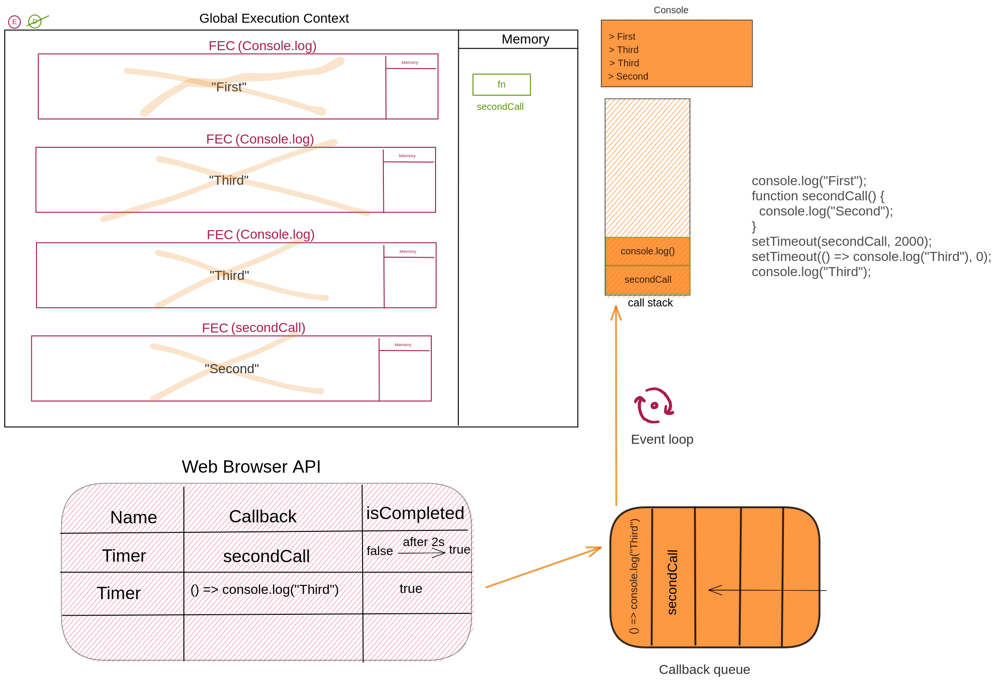

Create the execution context diagram of the following code. Also write the output of the code below. Keep in mind to have call stack, web browser API and event loop in the diagram. After creating the execution context diagram add the image to the `img` folder.

1.

```js
console.log("First");
setTimeout(() => console.log("Second"), 0);
console.log("Third");
```

Output:
First @ 0s
Third @ 0s
Second @ 1s


2.

```js
console.log("First");
function secondCall() {
  console.log("Second");
}
setTimeout(secondCall, 2000); // execute this code after 1000 ms
setTimeout(() => console.log("Third"), 0); // execute this code after 1000 ms
console.log("Third");
```

Output:
First @ 0s
Third @ 0s
Third @ 1s
Second @ 2s


3.

```js
console.log("First");
function secondCall() {
  console.log("Second");
}
setTimeout(secondCall, 1000); // execute this code after 1000 ms
setTimeout(() => console.log("Third"), 0);
console.log("Fourth");
```

Output:
First @ 0s
Fourth @ 0s
Third @ 1s
Second @ 2s


4.

```js
console.log("First");
function secondCall() {
  console.log("Second");
}
setTimeout(secondCall, 1000); // execute this code after 1000 ms
setTimeout(() => console.log("Third"), 0);
console.log("Fourth");
```

Output:
First @ 0s
Fourth @ 0s
Third @ 1s
Second @ 2s


5. What will be the output of the code below and why? Also write the timing of the output starting with 0 ms.

```js
function runWhileLoopForNSeconds(sec) {
  let start = Date.now(),
    now = start;
  while (now - start < sec * 1000) {
    now = Date.now();
  }
}
console.log("First");
setTimeout(function exec() {
  console.log("Second");
}, 0);
runWhileLoopForNSeconds(3);
console.log("Third");
```

Output:
First @ 0s
Third @ 3s
Second @ 3s


6. Convert the synchronous code given below into asynchronous. If you execute this code it will print one, two and three. Change the code in such a way that it should print `one`, `three` and `two`. You are not allowed to move the code up and down.

```js
console.log("one");
setTimeout(() => {
  console.log("two");
}, 0);
console.log("three");
```

7. Convert the synchronous code given below into asynchronous. If you execute this code it will print one, two and three. Change the code in such a way that it should print `one`, `three` and `two`. You are not allowed to move the code up and down.

```js
console.log("one");
setTimeout(() => {
  console.log("two");
}, 0);
console.log("three");
```

8. Write a function named `asyncForEach` that is similar to `forEach`. But `asyncForEach` is asynchronous in nature rather than synchronous.

```js
function asyncForEach(arr, cb) {
  setTimeout(() => {
    arr.forEach((elm) => cb(elm));
  }, 0);
  //
}
//  Output of the function below should be
// one
// three
//  1, 2, 3

console.log("one");
asyncForEach([1, 2, 3], (num) => console.log(num));
console.log("three");
```

9. Convert the following function into asynchronous. The output of the function will be

<!-- First Call -->
<!-- 1, 2, 3, 4, 5 -->
<!-- Last Call -->

Convert the code below in such way that the output should be the one below

<!-- First Call -->
<!-- Last Call -->
<!-- 1, 2, 3, 4, 5 -->

```js
console.log("First Call");
[1, 2, 3, 4, 5].forEach((num) => console.log(num));
console.log("Last Call");
```

```js
console.log("First Call");
setTimeout(
  [1, 2, 3, 4, 5].forEach((num) => console.log(num)),
  0
);
console.log("Last Call");
```
